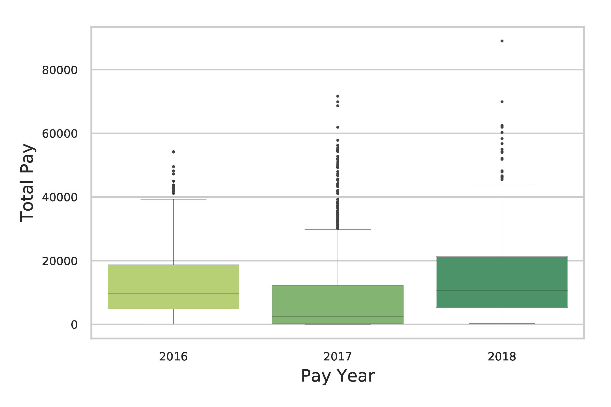
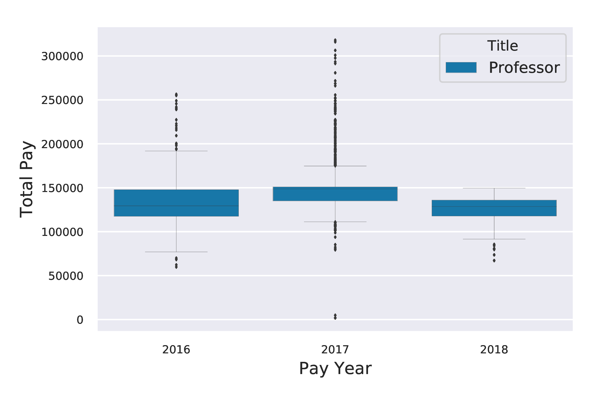

# Adjuncts-Professors-vs-Professors

This project is comparing the salary of Adjunct Professors vs. Professors (from 2016-2018) using the website
<ul>
  <li><a href= "www.seethroughny.net/payrolls"> SeeThroughNY </a></li>
  <li><a href = "openpayrolls.com"> OpenPayrolls </a></li>
</ul>

I generated many graphs (boxplots and bargraphs) for the different years:

<b> Bar Graphs </b> 
**Annual Salary for Adjunct Professors vs Full Time Professors from 2016 to 2018**

**Annual Salary for Adjuncts per School**

<b> BoxPlot </b>

**Boxplot- Annual Salary of Adjunct Professors**

**Boxplot- Annual Salary of Full Time Professors**

